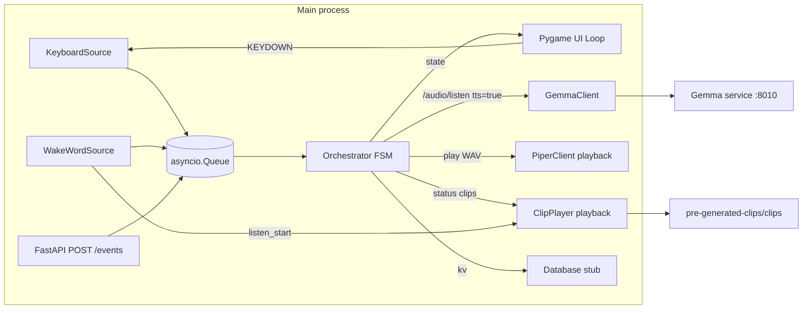

# Widushi learning app

Interactive Gemma-powered learning tutor that runs on a Raspberry Pi 5
with a 3.5" TFT display. Development happens on a Mac (Apple silicon)
in a Docker container that's binary-compatible with the Pi.

This subproject implements the main app. It lives beside the other
independent learning-app projects:

- [`../pre-generated-clips/`](../pre-generated-clips/) — Phase 1, offline TTS
  pipeline that builds the acknowledgement / status `.wav` library
  used by Phase 3+ (Piper for English, Indic-Parler-TTS for Hindi).
- [`../openwakeword/`](../openwakeword/) — the trained "Widushi" wake-word
  model files.
- [`../gemma-llama/`](../gemma-llama/) — local Gemma service exposing
  `/audio/listen` on port 8010 for spoken tutor questions and Piper-backed
  TTS output.
- [`app/`](app/) — pygame UI + asyncio FSM orchestrator + FastAPI control
  plane in a single process, with wake-word input and Gemma audio integration.

See [`../phases/overall.md`](../phases/overall.md) for the product brief and
the per-phase notes in [`../phases/`](../phases/).

## Architecture



The pygame loop, asyncio orchestrator, and uvicorn all share a single
event loop on the main thread (SDL requires the main thread). The
loop yields back via `await asyncio.sleep(1/FPS)` each frame so the
FSM and HTTP server keep running.

States (one face each): `IDLE`, `LISTENING`, `THINKING`, `SPEAKING`.

## Quickstart — Mac dev (host Python)

Requires Python 3.11+. SDL2 is bundled with the `pygame` wheel, so no
brew install is needed for host runs.

```bash
make install
make run
```

A 480x320 window opens with the IDLE face. The normal voice flow is:

```text
IDLE --wake word--> LISTENING --recorded audio--> THINKING --Gemma text + WAV--> SPEAKING --playback done--> LISTENING
```

After answer playback, the app opens a follow-up listen. If no follow-up voice is
heard before `LISTENING_SILENCE_TIMEOUT_S`, it cancels back to `IDLE`.

Drive the FSM by hand when debugging:

| Key     | Event             |
|---------|-------------------|
| `SPACE` | `WAKE_DETECTED`   |
| `ENTER` | stop active LISTENING recording, or emit `UTTERANCE_END` when no recording is active |
| `R`     | `REPLY_READY`     |
| `D`     | `PLAYBACK_DONE`   |
| `ESC`   | `CANCEL` (twice = shutdown) |

Or hit FastAPI on `http://localhost:8020`:

```bash
curl localhost:8020/state
curl -X POST localhost:8020/events \
  -H 'content-type: application/json' \
  -d '{"type":"WAKE_DETECTED"}'
```

Posting `UTTERANCE_END` while the app is actively recording requests the
recorder to finish and emit the audio-backed event. If no recording is active,
the event is enqueued directly for manual text/debug flows.

## Wake Word And Listening

Wake-word detection is enabled by default and uses
`../openwakeword/vDu_shee.onnx` for host runs. The model files can stay
in the sibling `../openwakeword/` folder; they do not need to move into
`learning-app`.

To point at another model, override `WAKE_WORD_MODEL`:

```bash
WAKE_WORD_MODEL=/path/to/vDu_shee.onnx \
make run
```

For headless development without microphone access, opt out with
`WAKE_WORD_ENABLED=0`.

The detector expects 16 kHz mono int16 PCM audio and emits
`WAKE_DETECTED` when the configured score crosses
`WAKE_WORD_THRESHOLD` (default `0.5`). Repeated detections are suppressed
for `WAKE_WORD_DEBOUNCE_S` seconds (default `2.0`).

After a wake detection, the same microphone stream is used to record the
student's question. The app wraps the captured mono 16 kHz int16 PCM in a WAV
container and emits `UTTERANCE_END` with `audio_bytes`, `filename`,
`content_type`, `sample_rate`, and `followup=false`.

Recording stops automatically after trailing silence or after the max recording
duration. If no voice is heard within the silence timeout (applied on every
`LISTENING` entry — both after the wake word and after a `SPEAKING -> LISTENING`
follow-up loopback), the app emits `CANCEL` and the FSM falls back to `IDLE`
without calling Gemma. The cancel event includes `cancel_reason="no_voice_detected"`
for logs and tests. Recording can also be stopped manually with ENTER or
`POST /events {"type":"UTTERANCE_END"}`.

The recorder decides whether the student has started speaking with an RMS-based
voice gate. It now requires multiple consecutive voiced chunks before setting
`voiced_seen=true`; a single 80 ms noise blip (fan, chair creak, breathing on
the mic, or the tail of `listen_start` echoing back through the speaker) should
not disarm the no-voice timeout. Once real voice is detected, trailing silence
ends the turn. Keep that trailing-silence window long enough for natural thinking
pauses between words and phrases, otherwise `LISTENING` can emit
`UTTERANCE_END` and move to `THINKING` mid-sentence.

After playback finishes, the FSM transitions `SPEAKING -> LISTENING` and the
wake-word source automatically opens a follow-up listen so the student can ask
another question without re-saying "Widushi". The same silence timeout governs
the follow-up; if nobody answers within `LISTENING_SILENCE_TIMEOUT_S`, the FSM
drops back to `IDLE` and the wake word is required again.
Follow-up `UTTERANCE_END` events include `followup=true`.

Useful tuning variables:

```bash
LISTENING_SILENCE_RMS_THRESHOLD=800
LISTENING_VOICE_ONSET_FRAMES=2
LISTENING_TRAILING_SILENCE_S=1.5
LISTENING_MIN_RECORDING_S=0.8
LISTENING_MAX_RECORDING_S=15.0
LISTENING_SILENCE_TIMEOUT_S=5.0
```

If the app still thinks silence is speech (typical symptom: every recording
runs to exactly `LISTENING_MAX_RECORDING_S` because trailing-silence never
fires), measure the local mic noise floor with the built-in calibration log:

```bash
WIDUSHI_RMS_DEBUG=1 make run
```

While set, every 80 ms recorder chunk is logged at INFO as

```text
INFO app.input.wakeword: rms[042] t=3.36s rms=124 thr=800 silent run=0 seen=True
```

Say "Widushi", stay quiet for a couple of seconds, then speak normally for a
few seconds, then stay quiet again. Read the `rms=` column: pick a
`LISTENING_SILENCE_RMS_THRESHOLD` comfortably above the quiet-room peaks but
below soft speech, then unset `WIDUSHI_RMS_DEBUG` so the per-chunk log goes
away. Bump `LISTENING_VOICE_ONSET_FRAMES` to `3` if isolated blips still sneak
through, or bump `LISTENING_TRAILING_SILENCE_S` to `2.0` if natural pauses cut
utterances short. The threshold is mic-specific, so re-run this whenever you
change the input device (USB mic swap, room change, AC on/off).

The wake-word source is FSM-aware: it only predicts on incoming mic frames
while the orchestrator is in `IDLE`. While the FSM is in `THINKING` or
`SPEAKING`, mic chunks are dropped and the wake-word frame buffer is cleared,
so background noise (or the user's continued talking) cannot fire
`WAKE_DETECTED` and start a phantom 15 s recording whose `UTTERANCE_END` the
FSM would silently ignore. Follow-up listens still work because they're armed
explicitly via the follow-up signal raised by `_followup_listen_side_effect`,
which is checked before the IDLE gate.

## Pre-generated Acknowledgement Clips

The app consumes the sibling
[`../pre-generated-clips/`](../pre-generated-clips/) project's WAV library for
short status cues. Clips are loaded from:

```text
../pre-generated-clips/clips/<lang>/<clip_id>.wav
```

Default language is English. Override it with:

```bash
WIDUSHI_CLIPS_LANG=en
```

Required phase-7 clips:

| Clip ID | When played |
|---------|-------------|
| `listen_start` | After `WAKE_DETECTED`, before recording starts |
| `wait_thinking` | During `THINKING` for first-turn questions |
| `wait_checking` | During `THINKING` for follow-up questions |

`ClipPlayer` shares pygame's mixer with reply playback, caches loaded WAVs, and
logs missing clips without failing the turn. The wake-word path plays
`listen_start` before `_record_utterance`, then drains the mic queue so captured
speaker audio does not prefix the user's question. The THINKING side effect plays
`wait_thinking` or `wait_checking` concurrently with the Gemma request and waits
for both to finish before emitting `REPLY_READY`, preventing reply audio from
overlapping the cue.

## Gemma Audio And TTS Service

The runtime app uses `GemmaClient` to send spoken questions to the local Gemma
service and request Piper audio in the same turn:

```http
POST http://localhost:8010/audio/listen
Content-Type: multipart/form-data
```

The request includes:

- `audio`: `question.wav` as `audio/wav`
- `stream`: `false`
- `tts`: `true`
- `voice`: configured voice id, default `warm-academic`

The response is expected to contain `text` and `audio_url`. The client resolves
`audio_url` against `GEMMA_URL`, fetches the WAV bytes, then emits
`REPLY_READY` with `text`, `audio_bytes`, `audio_duration_ms`, and `voice`.
That means the FSM remains in `THINKING` until both LLM output and Piper audio
are ready. `SPEAKING` only plays the prepared WAV and emits `PLAYBACK_DONE`
after playback finishes.

For manual/API text fallback turns, the app uses `/generate` with `tts=true`
and the same `audio_url` fetch behavior.

Configure the service target with:

```bash
GEMMA_URL=http://localhost:8010
GEMMA_TIMEOUT_S=120
GEMMA_TTS_ENABLED=true
GEMMA_TTS_VOICE=warm-academic
WIDUSHI_CLIPS_LANG=en
```

If the Gemma service returns `audio_error` or omits `audio_url` while TTS is
enabled, the app logs the failure and cancels the turn back to `IDLE`.

## Quickstart — Mac dev (Docker, headless)

The compose file runs the container with SDL's `dummy` video/audio
drivers, so the FSM and FastAPI come up but no window is shown.

```bash
make run-docker         # docker compose up --build, with wake word disabled
curl localhost:8020/health
make stop-docker
```

## Raspberry Pi 5 deploy

The reference Pi setup is a Pi 5 with an MHS35 3.5" SPI TFT (480×320,
ILI9486) driven by the kernel's `fbtft` stack, plus a USB mic and USB
speaker. There are two non-obvious bits worth knowing before the run
command makes sense:

- **Display.** SDL2 has no `fbcon`/`fbdev` driver, and `fbtft` panels
  do not expose `/dev/dri`, so `KMSDRM` is also out. Instead the app
  renders into an off-screen surface (`SDL_VIDEODRIVER=dummy`) and
  `app/hardware/fb_sink.py` copies each frame straight into `/dev/fb0`
  as packed RGB565. Set `WIDUSHI_FB_DEVICE=/dev/fb0` to enable the
  sink; leave it unset on Mac/dev and pygame's normal flip path runs.
  The MHS35 overlay needs `:rotate=90` (or `:rotate=270`) in
  `/boot/firmware/config.txt` so the framebuffer reports `480×320`
  matching `config.SCREEN_SIZE`.
- **Audio.** The Pi 5 has no on-board analog audio, so a USB audio
  device (or HDMI sink, or I2S DAC HAT) is required. With a USB mic
  and USB speaker plugged in, ALSA typically splits them across two
  cards:

  ```text
  $ aplay -l
  card 1: UACDemoV10 [UACDemoV1.0], device 0: USB Audio
  $ arecord -l
  card 0: Device [USB PnP Sound Device], device 0: USB Audio
  ```

  The default ALSA `default` PCM points at `hw:0,0`, which here is
  the capture-only mic — opening it for playback fails. The image
  ships [`docker/asound.conf`](docker/asound.conf) baked into
  `/etc/asound.conf` to fix this: it pins `default` capture to the
  USB mic (card 0) and `default` playback to the USB speaker
  (card 1). pygame's mixer and `sounddevice` both honour `default`,
  so no per-app device IDs are required when the cards line up.

  If your Pi enumerates the USB devices in a different order, either
  edit `docker/asound.conf` and rebuild, or override at runtime via:

  ```bash
  -e WIDUSHI_INPUT_DEVICE='USB PnP'    # mic, sounddevice substring
                                       # match (or an integer index)
  -e WIDUSHI_OUTPUT_DEVICE='UACDemoV1' # speaker, SDL device name
  -e SDL_AUDIODEV=plughw:1,0           # SDL/pygame ALSA fallback
  ```

  You can also drop the bundled `asound.conf` onto the *host* with
  `make install-asound`, which is handy if you want host-side tools
  (`aplay`, `arecord`, `speaker-test`) to follow the same routing.

Build and run:

```bash
# Run from the workspace root so Docker can package openwakeword/.
docker build -t widushi-app -f learning-app/docker/Dockerfile.app .

# Run from the workspace root so the clip bind-mount path resolves.
docker run --rm \
  --network host \
  --device /dev/fb0 --device /dev/snd \
  --group-add audio \
  -e SDL_VIDEODRIVER=dummy \
  -e SDL_AUDIODRIVER=alsa \
  -e WIDUSHI_FB_DEVICE=/dev/fb0 \
  -e GEMMA_URL=http://localhost:8010 \
  -e LISTENING_SILENCE_RMS_THRESHOLD=2500 \
  -e LISTENING_VOICE_ONSET_FRAMES=3 \ 
  -e WIDUSHI_RMS_DEBUG=1 \
  -v "$PWD/pre-generated-clips/clips:/pre-generated-clips/clips:ro" \
  widushi-app
```

Two things to know about that command:

- **Networking.** The Gemma stack (`gemma-llama-api`) publishes port `8010`
  on the host. Inside a bridged container `localhost` would point at the
  container itself, so `GEMMA_URL=http://localhost:8010` (the image default)
  fails with `httpx.ConnectError: All connection attempts failed`.
  `--network host` puts the app on the host's network namespace so
  `localhost:8010` resolves to the Gemma container's published port. With
  `--network host` the `-p 8020:8020` flag is redundant (Docker prints a
  warning) so it is dropped. If you'd rather keep bridge networking, swap
  `--network host` for `--add-host=host.docker.internal:host-gateway` and
  set `-e GEMMA_URL=http://host.docker.internal:8010` — that's what
  `learning-app/docker/docker-compose.yml` does for Mac dev.
- **Clip mount.** `ClipPlayer` resolves clips to
  `/pre-generated-clips/clips/<lang>/<id>.wav` (see `config.CLIPS_DIR`),
  but the image does not bake the clip set in. Without the bind-mount you
  get `clip not found: /pre-generated-clips/clips/en/listen_start.wav;
  skipping playback` warnings on every wake-word turn. Mounting the
  sibling [`../pre-generated-clips/clips/`](../pre-generated-clips/clips/)
  directory read-only at the same path makes `listen_start`,
  `wait_thinking`, and `wait_checking` audible.

Verify each subsystem on its own first; this saves a lot of time:

```bash
# Display: panel should briefly flash and then go black
cat /dev/urandom > /dev/fb0; sleep 0.5; dd if=/dev/zero of=/dev/fb0 bs=1M count=1

# Speaker (uses the asound.conf default = USB speaker)
speaker-test -c2 -twav

# Mic
arecord -d 3 -fS16_LE -r16000 -c1 /tmp/mic.wav
aplay /tmp/mic.wav
```

The image copies `openwakeword/` into `/openwakeword` and sets
`WAKE_WORD_MODEL=/openwakeword/vDu_shee.onnx`. It also downloads
openWakeWord's shared runtime models (including `melspectrogram.onnx`)
during the Docker build so wake-word detection does not need network
access on first boot.

## Development workflow

```bash
make lint     # ruff check
make test     # pytest -q (FSM, wake-word, no-voice, Gemma client tests)
make build    # docker build (Pi-compatible image)
make clean    # nuke caches and .venv
```

## Layout

```
app/
  main.py              entrypoint: pygame init + asyncio.run TaskGroup
  config.py            screen size, fps, ports, paths
  state.py             AppState enum
  events.py            Event dataclass + EventType enum
  orchestrator/        FSM owning state and dispatch table
  ui/loop.py           pygame loop coroutine
  ui/faces/            Idle/Listening/Thinking/Speaking face renderers
  services/            Gemma HTTP client, WAV/clip playback, Database stub
  hardware/            Mic / Camera / Display abstractions
  input/               KeyboardSource, WakeWordSource, utterance helpers
  api/server.py        FastAPI control plane
docker/
  Dockerfile.app       multi-arch base + SDL2 + Python deps
  docker-compose.yml   Mac headless dev compose
tests/
  test_fsm.py          end-to-end FSM walk and audio routing tests
  test_gemma.py        Gemma multipart client tests
  test_wakeword.py     wake-word, utterance recording, no-voice timeout tests
```

## Still Out Of Scope

- SQLite persistence on disk.
- USB camera capture and image pipelines.
- Streaming partial Gemma responses.
