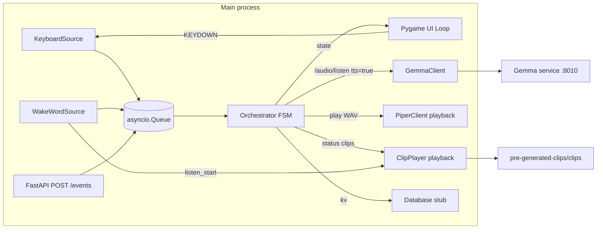

# Widushi learning app

Interactive Gemma-powered learning tutor that runs on a Raspberry Pi 5
with a 3.5" TFT display. Development happens on a Mac (Apple silicon)
in a Docker container that's binary-compatible with the Pi.

This subproject implements the main app. It lives beside the other
independent learning-app projects:

- [`../pre-generated-clips/`](../pre-generated-clips/) — Phase 1, offline TTS
  pipeline that builds the acknowledgement / status `.wav` library
  used by Phase 3+ (Piper for English, Indic-Parler-TTS for Hindi).
- [`../openwakeword/`](../openwakeword/) — the trained "Widushi" wake-word
  model files.
- [`../gemma-llama/`](../gemma-llama/) — local Gemma service exposing
  `/audio/listen` on port 8010 for spoken tutor questions and Piper-backed
  TTS output.
- [`app/`](app/) — pygame UI + asyncio FSM orchestrator + FastAPI control
  plane in a single process, with wake-word input and Gemma audio integration.

See [`../phases/overall.md`](../phases/overall.md) for the product brief and
the per-phase notes in [`../phases/`](../phases/).

## Architecture



The pygame loop, asyncio orchestrator, and uvicorn all share a single
event loop on the main thread (SDL requires the main thread). The
loop yields back via `await asyncio.sleep(1/FPS)` each frame so the
FSM and HTTP server keep running.

States (one face each): `IDLE`, `LISTENING`, `THINKING`, `SPEAKING`.

## Quickstart — Mac dev (host Python)

Requires Python 3.11+. SDL2 is bundled with the `pygame` wheel, so no
brew install is needed for host runs.

```bash
make install
make run
```

A 480x320 window opens with the IDLE face. The normal voice flow is:

```text
IDLE --wake word--> LISTENING --recorded audio--> THINKING --Gemma text + WAV--> SPEAKING --playback done--> LISTENING
```

After answer playback, the app opens a follow-up listen. If no follow-up voice is
heard before `LISTENING_SILENCE_TIMEOUT_S`, it cancels back to `IDLE`.

Drive the FSM by hand when debugging:

| Key     | Event             |
|---------|-------------------|
| `SPACE` | `WAKE_DETECTED`   |
| `ENTER` | stop active LISTENING recording, or emit `UTTERANCE_END` when no recording is active |
| `R`     | `REPLY_READY`     |
| `D`     | `PLAYBACK_DONE`   |
| `ESC`   | `CANCEL` (twice = shutdown) |

Or hit FastAPI on `http://localhost:8020`:

```bash
curl localhost:8020/state
curl -X POST localhost:8020/events \
  -H 'content-type: application/json' \
  -d '{"type":"WAKE_DETECTED"}'
```

Posting `UTTERANCE_END` while the app is actively recording requests the
recorder to finish and emit the audio-backed event. If no recording is active,
the event is enqueued directly for manual text/debug flows.

## Wake Word And Listening

Wake-word detection is enabled by default and uses
`../openwakeword/vDu_shee.onnx` for host runs. The model files can stay
in the sibling `../openwakeword/` folder; they do not need to move into
`learning-app`.

To point at another model, override `WAKE_WORD_MODEL`:

```bash
WAKE_WORD_MODEL=/path/to/vDu_shee.onnx \
make run
```

For headless development without microphone access, opt out with
`WAKE_WORD_ENABLED=0`.

The detector expects 16 kHz mono int16 PCM audio and emits
`WAKE_DETECTED` when the configured score crosses
`WAKE_WORD_THRESHOLD` (default `0.5`). Repeated detections are suppressed
for `WAKE_WORD_DEBOUNCE_S` seconds (default `2.0`).

After a wake detection, the same microphone stream is used to record the
student's question. The app wraps the captured mono 16 kHz int16 PCM in a WAV
container and emits `UTTERANCE_END` with `audio_bytes`, `filename`,
`content_type`, `sample_rate`, and `followup=false`.

Recording stops automatically after trailing silence or after the max recording
duration. If no voice is heard within the silence timeout (applied on every
`LISTENING` entry — both after the wake word and after a `SPEAKING -> LISTENING`
follow-up loopback), the app emits `CANCEL` and the FSM falls back to `IDLE`
without calling Gemma. The cancel event includes `cancel_reason="no_voice_detected"`
for logs and tests. Recording can also be stopped manually with ENTER or
`POST /events {"type":"UTTERANCE_END"}`.

After playback finishes, the FSM transitions `SPEAKING -> LISTENING` and the
wake-word source automatically opens a follow-up listen so the student can ask
another question without re-saying "Widushi". The same silence timeout governs
the follow-up; if nobody answers within `LISTENING_SILENCE_TIMEOUT_S`, the FSM
drops back to `IDLE` and the wake word is required again.
Follow-up `UTTERANCE_END` events include `followup=true`.

Useful tuning variables:

```bash
LISTENING_SILENCE_RMS_THRESHOLD=500
LISTENING_TRAILING_SILENCE_S=1.0
LISTENING_MIN_RECORDING_S=0.8
LISTENING_MAX_RECORDING_S=15.0
LISTENING_SILENCE_TIMEOUT_S=5.0
```

## Pre-generated Acknowledgement Clips

The app consumes the sibling
[`../pre-generated-clips/`](../pre-generated-clips/) project's WAV library for
short status cues. Clips are loaded from:

```text
../pre-generated-clips/clips/<lang>/<clip_id>.wav
```

Default language is English. Override it with:

```bash
WIDUSHI_CLIPS_LANG=en
```

Required phase-7 clips:

| Clip ID | When played |
|---------|-------------|
| `listen_start` | After `WAKE_DETECTED`, before recording starts |
| `wait_thinking` | During `THINKING` for first-turn questions |
| `wait_checking` | During `THINKING` for follow-up questions |

`ClipPlayer` shares pygame's mixer with reply playback, caches loaded WAVs, and
logs missing clips without failing the turn. The wake-word path plays
`listen_start` before `_record_utterance`, then drains the mic queue so captured
speaker audio does not prefix the user's question. The THINKING side effect plays
`wait_thinking` or `wait_checking` concurrently with the Gemma request and waits
for both to finish before emitting `REPLY_READY`, preventing reply audio from
overlapping the cue.

## Gemma Audio And TTS Service

The runtime app uses `GemmaClient` to send spoken questions to the local Gemma
service and request Piper audio in the same turn:

```http
POST http://localhost:8010/audio/listen
Content-Type: multipart/form-data
```

The request includes:

- `audio`: `question.wav` as `audio/wav`
- `stream`: `false`
- `tts`: `true`
- `voice`: configured voice id, default `warm-academic`

The response is expected to contain `text` and `audio_url`. The client resolves
`audio_url` against `GEMMA_URL`, fetches the WAV bytes, then emits
`REPLY_READY` with `text`, `audio_bytes`, `audio_duration_ms`, and `voice`.
That means the FSM remains in `THINKING` until both LLM output and Piper audio
are ready. `SPEAKING` only plays the prepared WAV and emits `PLAYBACK_DONE`
after playback finishes.

For manual/API text fallback turns, the app uses `/generate` with `tts=true`
and the same `audio_url` fetch behavior.

Configure the service target with:

```bash
GEMMA_URL=http://localhost:8010
GEMMA_TIMEOUT_S=120
GEMMA_TTS_ENABLED=true
GEMMA_TTS_VOICE=warm-academic
WIDUSHI_CLIPS_LANG=en
```

If the Gemma service returns `audio_error` or omits `audio_url` while TTS is
enabled, the app logs the failure and cancels the turn back to `IDLE`.

## Quickstart — Mac dev (Docker, headless)

The compose file runs the container with SDL's `dummy` video/audio
drivers, so the FSM and FastAPI come up but no window is shown.

```bash
make run-docker         # docker compose up --build, with wake word disabled
curl localhost:8020/health
make stop-docker
```

## Raspberry Pi 5 deploy

Build the image on the Pi (or push a multi-arch image) and run with
the framebuffer driver against the TFT plus host audio:

```bash
# Run from the workspace root so Docker can package openwakeword/.
docker build -t widushi-app -f learning-app/docker/Dockerfile.app .
docker run --rm \
  --device /dev/fb0 --device /dev/snd \
  -e SDL_VIDEODRIVER=fbcon \
  -e SDL_AUDIODRIVER=alsa \
  -p 8020:8020 \
  widushi-app
```

The image expects the Gemma service at `GEMMA_URL` (default
`http://localhost:8010`) and posts spoken questions to `/audio/listen` with
`tts=true`.
Wire it via `--network host` or set `GEMMA_URL` to point at the right hostname.
The image copies
`openwakeword/` into `/openwakeword` and sets
`WAKE_WORD_MODEL=/openwakeword/vDu_shee.onnx`.
It also downloads openWakeWord's shared runtime models, including
`melspectrogram.onnx`, during the Docker build so wake-word detection does not
need network access on first boot.

## Development workflow

```bash
make lint     # ruff check
make test     # pytest -q (FSM, wake-word, no-voice, Gemma client tests)
make build    # docker build (Pi-compatible image)
make clean    # nuke caches and .venv
```

## Layout

```
app/
  main.py              entrypoint: pygame init + asyncio.run TaskGroup
  config.py            screen size, fps, ports, paths
  state.py             AppState enum
  events.py            Event dataclass + EventType enum
  orchestrator/        FSM owning state and dispatch table
  ui/loop.py           pygame loop coroutine
  ui/faces/            Idle/Listening/Thinking/Speaking face renderers
  services/            Gemma HTTP client, WAV/clip playback, Database stub
  hardware/            Mic / Camera / Display abstractions
  input/               KeyboardSource, WakeWordSource, utterance helpers
  api/server.py        FastAPI control plane
docker/
  Dockerfile.app       multi-arch base + SDL2 + Python deps
  docker-compose.yml   Mac headless dev compose
tests/
  test_fsm.py          end-to-end FSM walk and audio routing tests
  test_gemma.py        Gemma multipart client tests
  test_wakeword.py     wake-word, utterance recording, no-voice timeout tests
```

## Still Out Of Scope

- SQLite persistence on disk.
- USB camera capture and image pipelines.
- Pi framebuffer auto-detection helpers.
- Streaming partial Gemma responses.
